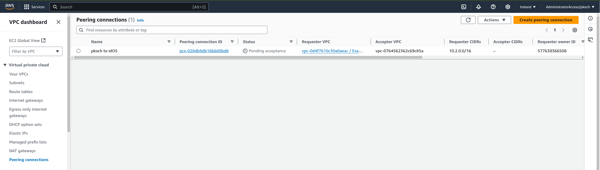

# Example idOS node with VPC peering

This example is meant to be a bare-bones version of what's necessary to participate in an idOS network.

1. You'll need to ask the idOS association for a few values to use in the next steps:

    - Access to the `idos-kgw` repository
    - Terraform variables
      - `remote_account_id`
      - `remote_peer_region`
      - `remote_vpc_id`
      - `remote_cidr_block`
      - `cidr_block`
    - Node files
      - `genesis.json`
      - `config.toml`

2. Fill in this module's variables.

    > 💡 Tip
    >
    > Use a `terraform.tfvars` file for them to be picked up automatically

3. Generate a ssh keypair

    ```bash
    ssh-keygen -f id_example
    ```

4. Apply this config by running

    ```bash
    terraform init
    terraform apply
    ```

5. Tell idOS what's your `vpc_peering_connection_id`, and wait for the peering request to be accepted

   You can get the `vpc_peering_connection_id` with `terraform output -raw vpc_peering_connection_id ; echo`

   Here's how you can expect to see on AWS's console.

   Before acceptance:
     
   After acceptance:
     

6. Configure the VM to run the node
   1. Connect to the VM

       ```bash
       ssh -i id_example ec2-user@`terraform output -raw instance_public_ip`
       ```

   2. Install docker and log out

       If you don't log out after running `usermod`, the addition to the `docker` group won't be picked up.

       ```bash
       sudo dnf install -y docker
       sudo usermod -a -G docker ec2-user
       sudo systemctl enable --now docker.service
       exit
       ```

   3. Connect to the VM again

       Note that we'll be using ssh agent forwarding (`-A`) to facilitate authentication with GitHub.

       ```bash
       ssh -A -i id_example ec2-user@`terraform output -raw instance_public_ip`
       ```

   4. Do the rest of the ambient setup

       ```bash
       sudo dnf install -y git git-lfs vim
       sudo curl -SL https://github.com/docker/compose/releases/download/v2.27.0/docker-compose-linux-x86_64 -o /usr/local/bin/docker-compose
       sudo chmod 755 /usr/local/bin/docker-compose
       ssh-keyscan github.com >> .ssh/known_hosts
       ```

   5. Clone `idos-kgw`

       ```bash
       git clone git@github.com:idos-network/idos-kgw.git
       cd idos-kgw
       git lfs pull
       ```

   6. Create initial configuration

       ```bash
       docker network create kwil-dev
       sed -i 's/^ARCH=arm64/ARCH=amd64/' .env
       docker-compose run --build --rm kwild ./kwild key gen --key-file /app/home_dir/nodekey.json
       exit
       ```

   7. Copy `genesis.json` `config.toml` files provided by idOS into `kwil-home-dir` folder

        ```bash
        scp -i id_example genesis.json ec2-user@`terraform output -raw instance_public_ip`:/data/kwild-home_dir
        scp -i id_example config.toml ec2-user@`terraform output -raw instance_public_ip`:/data/kwild-home_dir
        ```

7. Run the node in peer mode
   1. Connect to the VM again

        ```bash
        ssh -i id_example ec2-user@`terraform output -raw instance_public_ip`
        ```

   2. Run the node

        ```bash
        cd idos-kgw
        docker-compose -f compose.prod.yaml up -d --build --force-recreate
        ```

   3. Wait until the node catches up the network. It may take a few minutes.

        Watch the node logs
        ```bash
        docker-compose logs -f
        ```

        Look for obvious golang crash reports. Let us know if you need help fixing those.

        The node will take some time to catch-up with the rest of the network. Let it run for a while. Eventually, you should start observing line logs with `"msg":"finalizing commit of block"`.

   4.  Get back when you done

        ```bash
        exit
        ```

8.  How to make the node a validator

    1. Connect to the VM

        ```bash
        ssh -i id_example ec2-user@`terraform output -raw instance_public_ip`
        ```

    2. Request the network to become a validator

        ```bash
        cd idos-kgw
        docker-compose -f compose.prod.yaml run --rm kwild kwild validators join -s /sockets/kwild.socket
        ```

    3. Ask idOS to approve your request to join as a validator.

    4. Wait until majority nodes of the network vote on this request. To observe the status:

       1. Get the node's validator public key

          ```bash
          docker-compose -f compose.prod.yaml run --rm kwild kwild admin status --rpcserver /sockets/kwild.socketk | jq -r .validator.pubkey
          ```

       2. Look if the key is in validators list

          ```bash
          docker-compose -f compose.peer.yaml run --rm kwild kwild validators list -s /sockets/kwild.socket
          ```

       3. Get back

          ```bash
          exit
          ```

9. Provide the `instance_private_ip` output to idOS to be included in the load balancer.
